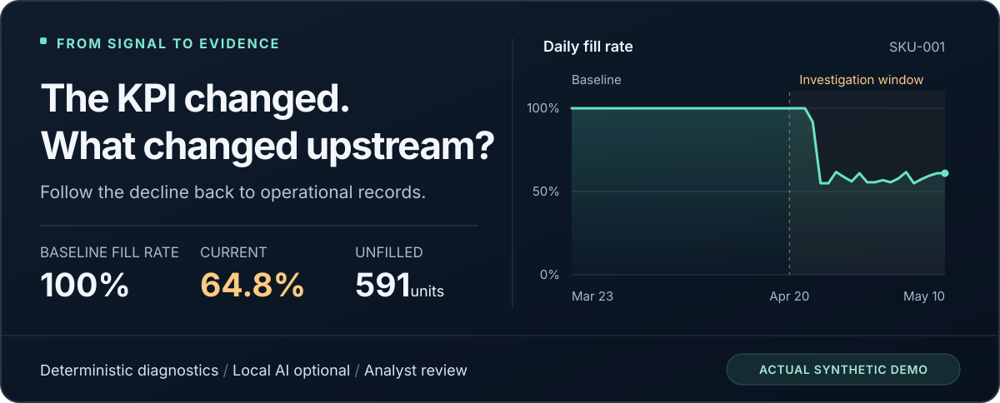
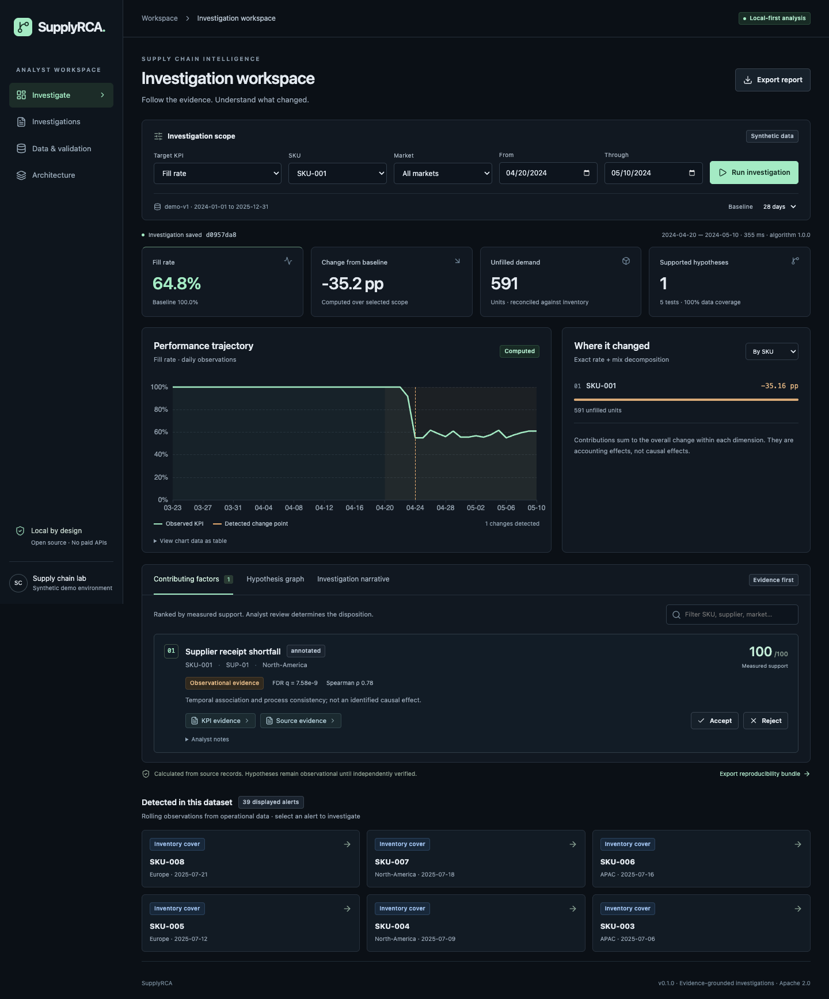

<div align="center">

<h1>SupplyRCA</h1>

<p><strong>Turn supply-chain KPI declines into evidence you can inspect.</strong></p>

<p>An open-source root-cause analysis engine for supply-chain KPI degradation.<br>
Deterministic statistics. Traceable findings. Optional local AI.</p>

<p>
  <a href="LICENSE">Apache 2.0</a> ·
  <a href="#quick-start">Runs locally</a> ·
  <a href="#optional-local-ai">No paid API required</a> ·
  <a href="docs/benchmarks/example/summary.md">Reproducible benchmarks</a>
</p>

<p>
  <a href="#see-an-investigation">See an investigation</a> ·
  <a href="#quick-start">Quick start</a> ·
  <a href="#how-it-works">How it works</a> ·
  <a href="#measured-results">Measured results</a> ·
  <a href="#contribute">Contribute</a>
</p>

</div>



When service deteriorates, the answer is usually scattered across demand, inventory, supplier receipts, purchase orders and transportation records. Analysts have to reconcile those sources before they can even test an explanation.

**SupplyRCA assembles the evidence, measures what changed and ranks supported operational hypotheses.** An analyst can follow each finding back to source records, challenge the explanation and export a reproducible investigation.

Built for supply-chain analysts, planners, supplier managers and operations leaders—and for engineers interested in evidence-grounded AI systems.

## See an investigation

The first-run demo opens a real computation over the committed synthetic dataset: **SKU-001, April 20–May 10, 2024**, compared with the preceding 28 days.

| What changed? | What SupplyRCA finds |
| :--- | :--- |
| Fill rate fell | **100.0% → 64.8%**, a **35.2 percentage-point** decline |
| Demand went unfulfilled | **591 units** in the investigation window |
| The time series shifted | A detected change point on **April 24** |
| An operational hypothesis has support | **Supplier receipt shortfall**, backed by linked receipt and inventory evidence |
| A decision still needs a person | Inspect the records; accept, reject or annotate the hypothesis |

The graph distinguishes accounting relationships, statistical associations and operational hypotheses. **A support score is not a probability of causation.**

<details>
<summary><strong>Open the actual investigation workspace</strong> — desktop screenshot</summary>



Captured from the working app using synthetic records. [Mobile screenshot](docs/screenshots/mobile.png) · [Reproduce these screenshots](docs/screenshots.md)

</details>

Once the app is running:

1. **Inspect the decline.** Compare baseline and current performance, then explore the daily timeline and SKU, supplier or market contributions.
2. **Follow the evidence.** Open **Source evidence** and inspect a purchase-order record with its source ID and provenance.
3. **Review the hypothesis.** Accept, reject or annotate it; the review persists across refreshes.
4. **Keep the investigation.** Reopen it from the archive or export Markdown and JSON reports.
5. **Change the question.** Choose another alert or investigate a different KPI, scope and date window.

## Quick start

Clone or download this repository, then run these commands from its root. Requires **Docker Engine and Docker Compose v2**.

```sh
cp .env.example .env
docker compose up --build
```

**Open [localhost:8080](http://localhost:8080)** · [Interactive API docs](http://localhost:8000/docs)

The demo validates and loads the committed sample, then opens a saved investigation. **No account, paid credentials or model download is required.** The default `AI_PROVIDER=none` uses deterministic, evidence-linked narratives.

> **Verification status:** Native application, PostgreSQL and browser workflows have been tested. Compose configuration is included, but container startup has not yet been verified on a Docker host. GitHub Actions execution is also pending. See the [recorded checks and release gates](docs/release-checklist.md).

Ports bind to localhost. The public demo database passwords are for local use only. `docker compose down` retains saved data; adding `-v` deletes the database and model volumes. Docker Desktop is optional, not an open-source dependency.

<details>
<summary><strong>Native setup — macOS / Linux</strong></summary>

Requires Python **3.12+** and Node.js **22.16+**. Native development uses SQLite; a PostgreSQL installation is optional.

Start the API from the repository root:

```sh
python3 -m venv .venv
source .venv/bin/activate
python -m pip install -r requirements-dev.lock
python -m pip install --no-deps -e .
uvicorn apps.api.main:create_app --factory --host 127.0.0.1 --port 8000
```

In a second terminal, from the repository root:

```sh
cd apps/web
npm install -g pnpm@11.25.0
pnpm install --frozen-lockfile
pnpm dev
```

Open [localhost:5173](http://localhost:5173). SQLite creates an ignored `supplyrca.db` in the repository root.

For native PostgreSQL, set `DATABASE_URL` and optionally `READ_DATABASE_URL`. Native processes read environment variables; they do not automatically load `.env`. If ports are occupied, choose another API port and set `API_PROXY_TARGET` for Vite and `ALLOWED_ORIGINS` for the API.

</details>

<details>
<summary><strong>Native setup — Windows PowerShell</strong></summary>

Requires Python **3.12+** and Node.js **22.16+**. Start the API from the repository root:

```powershell
py -3.12 -m venv .venv
.\.venv\Scripts\python.exe -m pip install -r requirements-dev.lock
.\.venv\Scripts\python.exe -m pip install --no-deps -e .
.\.venv\Scripts\python.exe -m uvicorn apps.api.main:create_app --factory --host 127.0.0.1 --port 8000
```

In a second PowerShell window, from the repository root:

```powershell
cd apps/web
npm install -g pnpm@11.25.0
pnpm install --frozen-lockfile
pnpm dev
```

Open [localhost:5173](http://localhost:5173). For Compose, use `Copy-Item .env.example .env`. Generator and benchmark commands are available under `.venv\Scripts\`. Native processes do not automatically load `.env`.

These Windows instructions have not been executed on Windows. Peak memory reporting is unavailable when Python's `resource` module is absent.

</details>

## What you can investigate

| KPI | Operational question | Definition used here |
| :--- | :--- | :--- |
| **Fill rate** | Where did fulfillment fall behind demand? | Total fulfilled units ÷ total demand |
| **Stockout rate** | Which SKU–market days had unmet demand? | Days with a shortfall ÷ days with positive demand, at the SKU–market grain |
| **Lead time** | Which supplier cohorts are taking longer? | Mean purchase-order cohort lead time |
| **Forecast accuracy** | Is demand moving away from the plan? | 1 − WAPE; may be negative |
| **Excess inventory** | Where is inventory cover increasing? | Closing inventory ÷ demand, aggregated over the window; a cover proxy, not valued excess stock |

Each investigation includes scope selection, a baseline comparison, contribution tables, a change-point timeline, ranked hypotheses, an evidence graph and a cited narrative. The workspace also includes searchable source tables, validation reports, saved investigations and analyst review history.

## How it works

The computational core owns the numbers and the investigation state. A local language model can help explain the findings after they have been calculated.

```mermaid
flowchart LR
  accTitle: From operational records to an analyst-reviewed report
  accDescr: Validated records feed deterministic diagnostics. Invalid bundles are quarantined. Findings go directly to the analyst workspace&#59; a local model can optionally narrate them through output validation. Analysts review and export the investigation.
  records["Operational records"]
  validate["Validate and snapshot"]
  quarantine["Visible quarantine"]
  core["Deterministic RCA"]
  model["Local model + output checks"]
  workspace["API + analyst workspace"]
  report["Saved review + report"]
  records --> validate
  validate -->|invalid| quarantine
  validate -->|valid| core
  core -->|findings + template| workspace
  core -.->|optional| model
  model -->|validated narrative| workspace
  workspace --> report
%% portable-canonical-v2:eyJhY2Nlc3NpYmlsaXR5IjoiVmFsaWRhdGVkIHJlY29yZHMgZmVlZCBkZXRlcm1pbmlzdGljIGRpYWdub3N0aWNzLiBJbnZhbGlkIGJ1bmRsZXMgYXJlIHF1YXJhbnRpbmVkLiBGaW5kaW5ncyBnbyBkaXJlY3RseSB0byB0aGUgYW5hbHlzdCB3b3Jrc3BhY2U7IGEgbG9jYWwgbW9kZWwgY2FuIG9wdGlvbmFsbHkgbmFycmF0ZSB0aGVtIHRocm91Z2ggb3V0cHV0IHZhbGlkYXRpb24uIEFuYWx5c3RzIHJldmlldyBhbmQgZXhwb3J0IHRoZSBpbnZlc3RpZ2F0aW9uLiIsImRhdGEiOnsiZGlyZWN0aW9uIjoiTFIiLCJlZGdlcyI6W3siZnJvbSI6InJlY29yZHMiLCJ0byI6InZhbGlkYXRlIn0seyJmcm9tIjoidmFsaWRhdGUiLCJsYWJlbCI6ImludmFsaWQiLCJ0byI6InF1YXJhbnRpbmUifSx7ImZyb20iOiJ2YWxpZGF0ZSIsImxhYmVsIjoidmFsaWQiLCJ0byI6ImNvcmUifSx7ImZyb20iOiJjb3JlIiwibGFiZWwiOiJmaW5kaW5ncyArIHRlbXBsYXRlIiwidG8iOiJ3b3Jrc3BhY2UifSx7ImFycm93IjoiLS4tPiIsImZyb20iOiJjb3JlIiwibGFiZWwiOiJvcHRpb25hbCIsInRvIjoibW9kZWwifSx7ImZyb20iOiJtb2RlbCIsImxhYmVsIjoidmFsaWRhdGVkIG5hcnJhdGl2ZSIsInRvIjoid29ya3NwYWNlIn0seyJmcm9tIjoid29ya3NwYWNlIiwidG8iOiJyZXBvcnQifV0sIm5vZGVzIjpbeyJpZCI6InJlY29yZHMiLCJsYWJlbCI6Ik9wZXJhdGlvbmFsIHJlY29yZHMifSx7ImlkIjoidmFsaWRhdGUiLCJsYWJlbCI6IlZhbGlkYXRlIGFuZCBzbmFwc2hvdCJ9LHsiaWQiOiJxdWFyYW50aW5lIiwibGFiZWwiOiJWaXNpYmxlIHF1YXJhbnRpbmUifSx7ImlkIjoiY29yZSIsImxhYmVsIjoiRGV0ZXJtaW5pc3RpYyBSQ0EifSx7ImlkIjoibW9kZWwiLCJsYWJlbCI6IkxvY2FsIG1vZGVsICsgb3V0cHV0IGNoZWNrcyJ9LHsiaWQiOiJ3b3Jrc3BhY2UiLCJsYWJlbCI6IkFQSSArIGFuYWx5c3Qgd29ya3NwYWNlIn0seyJpZCI6InJlcG9ydCIsImxhYmVsIjoiU2F2ZWQgcmV2aWV3ICsgcmVwb3J0In1dfSwiZGVzY3JpcHRpb24iOm51bGwsImlkIjoic3VwcGx5cmNhLXJlYWRtZS1hcmNoaXRlY3R1cmUiLCJraW5kIjoiZmxvd2NoYXJ0Iiwic291cmNlU2hhMjU2IjoiZDg3YWY4NTIxZjQ1OTUwMjA5MWViNDI2NGRhNTFmOWRiZWFlYjEwOTkyMWQ4NTAwMTFkMmMxZjVmZmZmMTJjNiIsInN0eWxlcyI6W10sInRpdGxlIjoiRnJvbSBvcGVyYXRpb25hbCByZWNvcmRzIHRvIGFuIGFuYWx5c3QtcmV2aWV3ZWQgcmVwb3J0IiwidmVyc2lvbiI6MX0
```

<!-- supplyrca-readme-architecture -->


| Engineering choice | Why it matters |
| :--- | :--- |
| **Aggregate numerators and denominators first** | Fill rate reflects actual demand volume instead of an average of percentages. |
| **Exact symmetric rate/mix decomposition** | Contributions reconcile to the total KPI change within each dimension; mix shifts stay visible. |
| **PELT change points and corrected statistical tests** | Directional Mann–Whitney tests use Benjamini–Hochberg correction across all tested candidates. Spearman associations remain explicitly observational. |
| **Operational evidence gates** | Receipt shortfalls, transport delays, demand surges and forecast bias require supporting signals before they become hypotheses. |
| **Immutable inputs and append-only reviews** | Source and deterministic-result hashes, parameters and review events make investigations auditable and reproducible. |
| **Structured, bounded model output** | Schema and citation checks reject invalid responses; failures preserve the deterministic results and fall back to a template. |

Business logic lives in [`packages/supplyrca/domain`](packages/supplyrca/domain), separate from HTTP handlers and UI components. [Architecture](docs/architecture.md) · [Statistical assumptions](docs/evaluation.md) · [AI design](docs/ai-design.md)

### Technology stack

| Layer | Open-source components |
| :--- | :--- |
| Computation | Python, Polars, SciPy, ruptures |
| API and persistence | FastAPI, Pydantic, SQLAlchemy, PostgreSQL 17 in Compose; SQLite for native development |
| Analytical workspace | React, TypeScript, Vite, Apache ECharts, Lucide |
| Optional model runtimes | Ollama, llama.cpp, vLLM |
| Quality and delivery | pytest, Ruff, Vitest, Playwright, Docker Compose, GitHub Actions workflows |

[Architecture decisions](docs/adr/001-scope-and-storage.md) · [Dependency and model licenses](docs/open-source-licenses.md)

## Measured results

The committed benchmark runs use **seed 42**, **no LLM**, and **macOS arm64 with 10 logical CPUs and Python 3.12.14**. These are measurements from this implementation, with raw outputs available for inspection.

| Metric | Committed demo | Larger generated run |
| :--- | ---: | ---: |
| Source records | 23,396 | 233,924 |
| Seeded incidents / healthy controls | 40 / 16 | 400 / 160 |
| Top-1 known-cause recovery | 100% (40/40) | 100% (400/400) |
| False contributor rate | 0% | 0% |
| Healthy-window false alert rate | 0% | 0% |
| Change point within ±7 days of onset | 100% | 100% |
| Mean absolute onset error | 3.525 days | 3.470 days |
| Narrative citation coverage | 100% | 100% |
| Median / P95 diagnosis time | 7.037 / 7.996 ms | 7.135 / 7.674 ms |
| Peak process memory | 260.3 MiB | 1,074.9 MiB |

**Read these results in context.** The generator and diagnostics share mechanism assumptions. Perfect recovery on these synthetic cases does **not** establish accuracy on operational data; the larger run adds volume, not new failure mechanisms. Citation coverage measures resolvable references in deterministic templates, not LLM factuality. Timing covers analysis and narration in a warmed process, excluding data loading, validation, assembly, database and network work; it is not end-to-end application latency.

[Demo JSON](docs/benchmarks/example/benchmark.json) · [Episode-level CSV](docs/benchmarks/example/episodes.csv) · [Larger-run report](docs/benchmarks/performance/summary.md) · [Evaluation methodology](docs/evaluation.md)

Reproduce a benchmark after native setup:

```sh
supplyrca-benchmark --output artifacts/benchmark
```

Generate and measure the larger dataset:

```sh
supplyrca-benchmark --generate-skus 80 --seed 42 --data data/generated/performance --output artifacts/performance
```

Both runs write **JSON, CSV and Markdown** with hardware, dataset, algorithm and model configuration metadata.

## Data you can inspect and regenerate

The committed sample covers **24 months**, **8 SKUs**, **4 suppliers** and **3 markets**, with **40 seeded operational failures** across five mechanisms: supplier shortfalls, transportation delays, demand surges, underforecasting and overforecasting.

Every record carries a stable ID, source ID, ingestion timestamp and validation status. The generator preserves inventory balances. Ground truth is stored separately and is **never supplied to the diagnostic engine**.

```sh
supplyrca-generate --seed 42 --skus 8 --output data/generated/demo
python scripts/unpack_dataset.py data/generated/demo/dataset.json.gz data/generated/demo/dataset.json
```

Import the uncompressed JSON through **Data & validation** or the versioned API. Uploads are bounded to **16 MiB**; larger datasets belong in the offline harness. Invalid bundles are quarantined with visible errors, never silently cleaned away. Try [`invalid-bundle.json`](data/sample/invalid-bundle.json) to inspect that path.

[Data dictionary, grain and units](docs/data-model.md) · [JSON schemas](data/schemas) · [Generator source](packages/supplyrca/data/generate.py)

## Optional local AI

**The entire deterministic workflow works with AI disabled.** Enable a local runtime when you want a model-written investigation narrative with evidence links.

```sh
docker compose --profile ai up -d ollama
docker compose exec ollama ollama pull qwen2.5:7b
# Set AI_PROVIDER=ollama in .env, then restart the API:
docker compose up -d --force-recreate api
```

The default model choice, **Qwen2.5-7B-Instruct**, uses Apache 2.0; weights are downloaded separately. Model licenses vary, including within a model family. Check the terms before substituting weights.

The adapter also supports locally hosted llama.cpp and vLLM endpoints. Runtime configuration belongs to the server. Retrieved content is treated as untrusted data, and the model cannot execute shell commands, SQL or state-changing tools. Missing evidence triggers abstention; runtime and output-validation failures trigger a deterministic fallback. Existing investigations retain their original narratives.

Local-model inference has not yet been measured in the committed results; the adapter's validation and failure paths have been tested. [Configuration, safeguards and telemetry](docs/ai-design.md)

## API and reproducible reports

Create the featured investigation:

```sh
curl -X POST http://localhost:8000/api/v1/investigations \
  -H 'Content-Type: application/json' \
  -H 'X-SupplyRCA-Client: analyst' \
  -H 'Idempotency-Key: README-example-001' \
  -d '{
    "dataset_id": "demo-v1",
    "kpi": "fill_rate",
    "start": "2024-04-20",
    "end": "2024-05-10",
    "baseline_days": 28,
    "sku": "SKU-001"
  }'
```

The versioned REST API provides typed schemas, pagination, consistent error objects, separate read/mutation routes, health and readiness checks. Repeating an idempotency key with the same payload returns the saved investigation; a different payload returns `409`.

Independently verify an exported JSON report against its original source bundle:

```sh
python scripts/reproduce_report.py data/sample/dataset.json.gz path/to/report.json
```

Use the original data and pinned dependency versions. The deterministic hash deliberately excludes analyst reviews and optional narrative. [API reference](docs/api.md)

## Verification and tests

Recorded local verification includes **52 backend tests**, **5 frontend unit tests** and **2 browser E2E tests**, plus a separately executed PostgreSQL integration test. One PostgreSQL test is skipped in the default backend suite. The browser workflow exercises evidence inspection, review persistence and report export, including a mobile viewport.

<details>
<summary><strong>Run the checks</strong></summary>

From the repository root with the native environment activated:

```sh
ruff check .
ruff format --check .
pytest --cov=supplyrca --cov=apps.api
```

Frontend checks:

```sh
cd apps/web
pnpm lint
pnpm typecheck
pnpm test
pnpm build
pnpm exec playwright install chromium
# With the API and Vite running:
pnpm test:e2e
```

Coverage includes inventory accounting, fixed-seed behavior, no-event windows, missing evidence, malformed imports, zero denominators, authorization, idempotency conflicts and failed or malicious model output.

</details>

The [CI workflow](.github/workflows/ci.yml) defines backend, frontend, PostgreSQL, container/browser and dependency checks. **Recorded local results are not a claim that GitHub CI has run.** [Verification record](docs/verification.md) · [Release checklist](docs/release-checklist.md)

## Scope, security and limitations

SupplyRCA is a **working local reference implementation** for a single analyst. The default demo uses synthetic data and makes no external AI calls. Token mode protects versioned API routes; queries are parameterized, imports are validated and bounded, and Compose supplies a separate read-only PostgreSQL role for queries.

Before adapting it to real operations, understand these boundaries:

- **Observational evidence:** Associations and hypothesis scores do not identify causal effects. Autocorrelation affects exploratory p-values; thresholds require calibration on independent operational cases.
- **Simplified transactions:** Daily PO and shipment cohorts do not represent a full ERP event ledger, partial-receipt lifecycle or backorder system. No live enterprise integration is claimed.
- **Deployment scope:** Tenant permissions, SSO, durable background jobs, managed migrations and production rate limiting are future work.
- **Narrative reliability:** Valid citations do not guarantee a model's interpretation is correct. Analyst review remains part of the workflow; private chain-of-thought is neither requested nor stored.

[Threat model and deployment boundaries](docs/security.md) · [Report a vulnerability privately](SECURITY.md)

## Roadmap

The next five improvements deepen the evidence and operational model:

1. **Calibrate on independent cases:** Held-out, mixed-cause and negative cases, with methods that account for time-series dependence.
2. **Represent order and receipt events:** Partial receipts, cancellations, shipment legs, backorders and late-arriving records.
3. **Run investigations in durable workers:** Queues, cancellation, resource budgets and asynchronous narratives.
4. **Add migrations and authorization domains:** Versioned schemas, workspace roles and tested backup/restore.
5. **Measure narrative fidelity:** Model digests, reproducible runtime comparisons and independently assessed unsupported claims.

[Detailed engineering roadmap and acceptance criteria](docs/roadmap.md)

## Contribute

**Bring a counterexample.** A reproducible case where a hypothesis ranks incorrectly, a balance fails or an explanation overstates its evidence is especially valuable.

Contributions can also improve accessibility, add diagnostic tests, strengthen validation or benchmark another local model. For a useful report, include the seed or a minimal synthetic dataset, investigation parameters, expected behavior and actual output. **Do not attach private operational records or credentials.**

Start with the [contribution guide](CONTRIBUTING.md) and [code of conduct](CODE_OF_CONDUCT.md). If SupplyRCA is useful to your team or research, a star or a shared reproducible investigation helps others discover it.

## Explore the repository

| If you want to… | Start here |
| :--- | :--- |
| Understand the design | [Architecture](docs/architecture.md) · [ADRs](docs/adr) |
| Read the analytical core | [Domain analysis](packages/supplyrca/domain/analysis.py) · [Evaluation harness](packages/supplyrca/evaluation/benchmark.py) |
| Understand the inputs | [Data model](docs/data-model.md) · [Schemas](data/schemas) |
| Adapt the local-model layer | [AI design](docs/ai-design.md) · [Narrative adapter](packages/supplyrca/ai/narrative.py) |
| Integrate or reproduce a result | [API reference](docs/api.md) · [Report verification](scripts/reproduce_report.py) |
| Review readiness | [Release checklist](docs/release-checklist.md) · [Security model](docs/security.md) |
| Navigate all source files | [Complete repository tree](docs/repository-tree.md) |

---

Licensed under **[Apache 2.0](LICENSE)**. Material dependencies and model terms are documented in [open-source licenses](docs/open-source-licenses.md). No paid API or proprietary cloud AI service is required for the core workflow.
